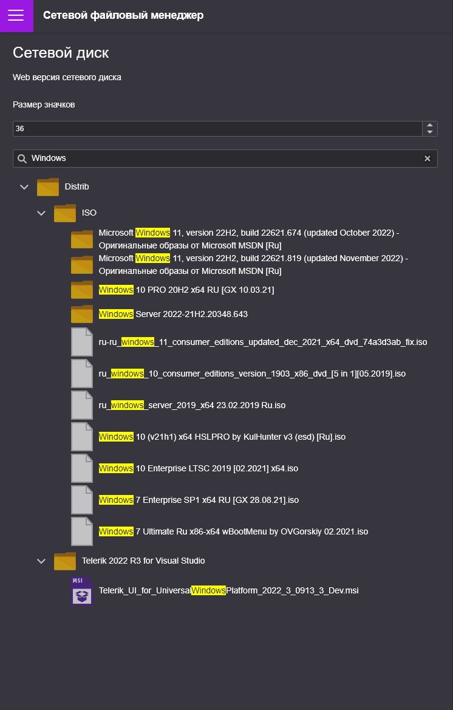

## Web File Manager
---
*  __Локальный файловый менеджер работающий через интернет__ 
*  __Создаёт мост для скачивания файлов путём передачи файла через контроллер__

Для использования должен быть установлен  [*ASP NET Core* Runtime v6.0](https://dotnet.microsoft.com/en-us/download) 

В проекте есть файл с директорией поиска __sharedirectory.txt__
Если файла не будет, по-умолчанию будет присвоена директория _C:\\_

```csharp
var execute = Assembly.GetExecutingAssembly().Location;
execute = execute.Substring(0, execute.LastIndexOf("\\"));
try { path = File.ReadAllText(execute + @"\sharedirectory.txt"); }
catch (Exception ex) { Console.WriteLine(ex.Message); path = "C:\\"; }
```


Так же можно обработать и сетевые пути UNC по типу __\\\\myserver\\work__

Внимание!!! НА ДАННЫЙ МОМЕНТ Менеджер не поддерживает исключения папок, такие как _"нету прав"_ или _"системная папка"_ 

[](https://sditsoft.ru/%D0%BF%D0%BE%D0%BB%D1%8C%D0%B7%D0%BE%D0%B2%D0%B0%D1%82%D0%B5%D0%BB%D1%8C%D1%81%D0%BA%D0%BE%D0%B5-%D1%81%D0%BE%D0%B3%D0%BB%D0%B0%D1%88%D0%B5%D0%BD%D0%B8%D0%B5/)

Visual Studio support

| 2022 (17.4.3) | 2022 (17.2.1) | 2019 (16.6)|
| :----: | :----: | :----------------: |
|  :heavy_check_mark:   |  :x:   | :x: |

<details>
  <summary>IMAGES</summary>
  
 
 
 
 
 
 
 
 
</details>

---

