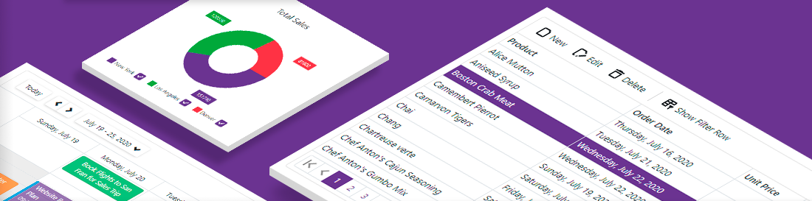
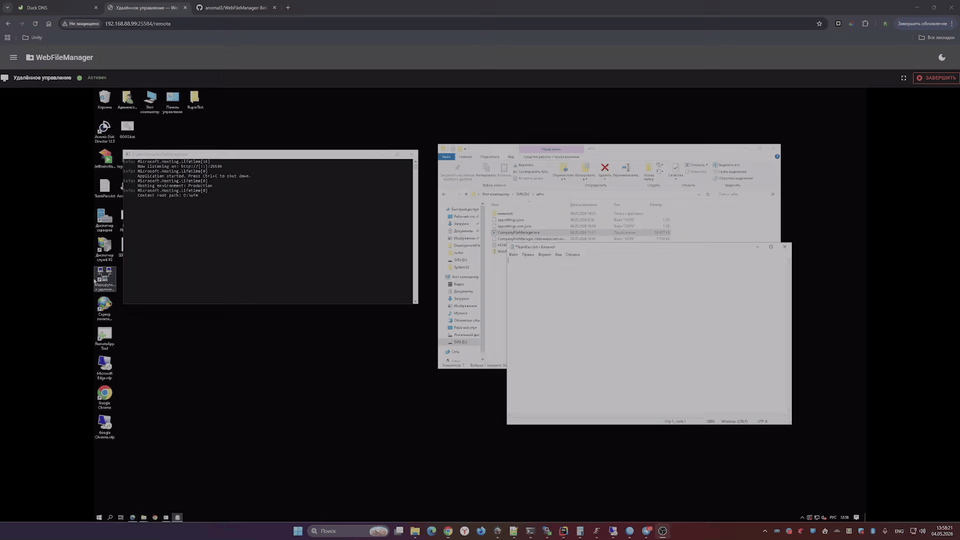
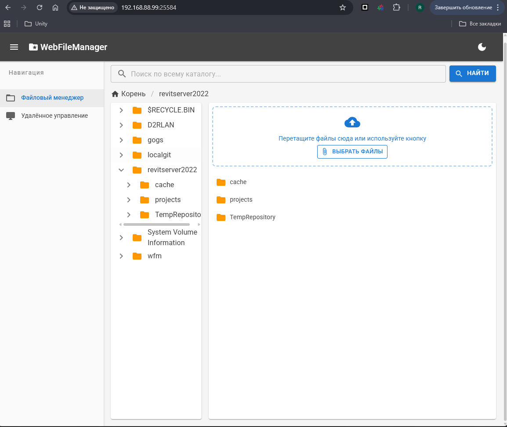

<p align="center">
  
</p>

<h1 align="center">WebFileManager</h1>

<p align="center">
  <b>Веб-файловый менеджер с удалённым управлением рабочим столом.</b><br/>
  Запустите один <code>.exe</code> — и любая папка на вашем компьютере становится доступна через интернет<br/>
  с любого устройства, где есть браузер.
</p>

<p align="center"><i>Никакого облака. Никаких регистраций. Файлы остаются у вас.</i></p>

---

## Демонстрация

<p align="center">
  
</p>

<p align="center">
  
</p>

> [Скачать оригинал в WebM](CompanyFileManager/Wfm1.webm) (HD-качество, 2.3 МБ)

---

## Зачем это нужно

Делиться файлами между своими устройствами и с друзьями — больно:
- **Облачные сервисы** ограничивают размер, показывают рекламу и видят ваши файлы
- **FTP/SMB** требуют сложной настройки и проброса портов
- **Почта** не годится для больших файлов
- **Telegram/мессенджеры** жмут картинки и режут видео

WebFileManager решает это так:
- **Один exe-файл** (~60 МБ, .NET runtime внутри). Ничего ставить не надо
- **Автоматический проброс порта** через UPnP роутера
- **Поддержка DDNS** (DuckDNS) для домашних компьютеров с динамическим IP
- **Постоянная ссылка** для друзей в один клик
- **Удалённый рабочий стол** прямо в браузере — без TeamViewer и AnyDesk
- **Всё через веб** — пользователь открывает ссылку и получает интерфейс

---

## Быстрый старт

1. Скачайте `WebFileManager_win-x64.zip` из [Releases](https://github.com/anomal3/WebFileManager/releases)
2. Распакуйте куда угодно
3. Запустите `CompanyFileManager.exe`
4. В браузере откроется `http://localhost:5000`
5. Нажмите шестерёнку **Настройки** → выберите папку → нажмите **«Применить»**
6. Скопируйте публичную ссылку → отправьте друзьям

> **Совет:** При первом запуске Windows может предупредить о неподписанной программе. Нажмите «Подробнее» → «Выполнить в любом случае».

---

## Возможности

### Файловый менеджер
- **Дерево каталогов** с ленивой загрузкой — работает с папками на десятки тысяч файлов
- **Умный поиск** по всему опубликованному каталогу — асинхронный, с кнопкой отмены, переживает ошибки доступа
- **Предпросмотр текстовых файлов** прямо в интерфейсе (.txt, .json, .md, .log, .cs, .py, .js и др.)
- **Скачивание** — прямой стриминг файла, без буферизации в памяти
- **Drag & Drop загрузка** — перетащите файлы в правую панель
- **Загрузка через кнопку** — для тех, кому удобнее
- **Иконки** для 30+ типов файлов (Office, CAD, код, архивы, изображения)
- **Хлебные крошки** для навигации
- **Адаптивный дизайн** — отлично работает на телефоне

### Сеть и публикация
- **Kestrel слушает на 0.0.0.0** — доступен по локальной сети сразу
- **Автоматический проброс порта** через UPnP (с обработкой роутеров, требующих permanent lease)
- **Определение публичного IP** через ipify.org / icanhazip / Amazon
- **Поддержка DuckDNS** для динамического IP — получите постоянное имя `мояпапка.duckdns.org`
- **Смена порта на лету** — нажали «Перезапустить», новый процесс стартует на новом порту, браузер сам редиректится
- **Готовые ссылки** для локальной сети и интернета

### Права доступа
- **Два режима**:
  - **Админ** (вы, с localhost): полный интерфейс с настройками
  - **Гость** (все остальные): только файловый менеджер + удалённое управление если разрешено
- **Только чтение или чтение+запись** — переключатель в настройках
- **Песочница пути** — гость не может выйти за пределы опубликованной папки

### Удалённый рабочий стол
- **Управление через браузер** — никаких клиентов ставить не нужно
- **Мышь, клавиатура, прокрутка** — всё передаётся
- **Полный экран** — кнопка с плавающим тулбаром, Esc для выхода
- **Захват клавиатуры на уровне document** — работает не только когда canvas в фокусе
- **15 кадров/сек** с двойной буферизацией и `requestAnimationFrame` рендером для плавности
- **Соблюдение пропорций экрана** (letterbox) — изображение не растягивается
- **WebSocket через SignalR** — проходит через большинство файрволов (без UDP)
- **Опциональный пароль** для доступа к удалённому управлению

### Интерфейс
- **MudBlazor** (Material Design) — современный, чистый, отзывчивый
- **Светлая и тёмная темы** — переключатель в шапке, сохраняется в `localStorage`
- **Выбор папки** через системный диалог — навигация по дискам и подпапкам
- **Уведомления** через Snackbar — успех/ошибки/предупреждения

---

## Под капотом

| Слой | Технология |
|---|---|
| HTTP-сервер | ASP.NET Core 10 + Kestrel |
| UI | Blazor Server (SignalR-канал к серверу) |
| Компоненты | MudBlazor 6 |
| Реал-тайм | SignalR (для удалённого экрана) |
| NAT-traversal | Mono.Nat 3 (UPnP / PMP) |
| Захват экрана | System.Drawing.Common (GDI+ `CopyFromScreen`) |
| Эмуляция ввода | `user32.dll` P/Invoke (`SendInput`) |
| Конфигурация | JSON-файл рядом с exe |

### Что происходит при нажатии «Применить» в настройках

1. Настройки сохраняются в `appsettings.user.json` рядом с exe
2. Запускается UPnP-discovery — находит роутер, открывает указанный порт
3. Если роутер не принимает 24-часовой lease (ошибка 725) — повторный проброс с permanent (lease=0)
4. Запрос публичного IP по HTTPS (несколько фоллбэков)
5. Если задан DuckDNS-токен — обновляется DDNS-запись
6. Генерируется и отображается ссылка
7. Если порт изменился — кнопка «Перезапустить»: запускается новая копия exe, старая останавливается, браузер редиректится на новый порт

---

## Системные требования

- **Windows 10 / 11 x64** (для удалённого рабочего стола нужен именно Windows — используется GDI+ и `SendInput`)
- ~150 МБ места на диске
- Прав администратора **не нужно** (программа не устанавливается, всё в одной папке)
- Для UPnP — роутер с включённым UPnP
- Для удалённого экрана — Windows только на хосте; клиенты могут быть на любой ОС с браузером

---

## Сборка из исходников

```bash
git clone https://github.com/anomal3/WebFileManager
cd WebFileManager
build.bat
```

Что получится:
- `Release\CompanyFileManager.exe` — ~60 МБ self-contained single-file
- `Release\wwwroot\` — статика (CSS/JS/иконки)
- `Dist\WebFileManager_win-x64.zip` — упакованный для распространения архив

Требования для сборки: **.NET 10 SDK** ([скачать](https://dot.net)).

---

## Файл конфигурации

Все настройки в `appsettings.user.json` рядом с exe:

```json
{
  "SharedDirectory": "D:\\Shared",
  "AllowUpload": true,
  "Port": 5000,
  "EnableUpnp": true,
  "DuckDnsToken": "ваш-токен-если-есть",
  "DuckDnsDomain": "myhome.duckdns.org",
  "AllowRemoteControl": false,
  "RemoteControlPassword": "",
  "IsConfigured": true
}
```

Можно править вручную или через UI — результат одинаковый.

---

## Ограничения

- **Только Windows** — захват экрана и эмуляция ввода используют WinAPI
- **Один пользователь удалённого экрана за раз** — рассчитано на личное использование
- **Без HTTPS из коробки** — для публикации в интернете запускайте за reverse-proxy с TLS (nginx, Caddy, Cloudflare Tunnel)
- **UPnP работает не везде** — корпоративные сети и некоторые провайдеры его блокируют. Ручной проброс порта в роутере всегда сработает
- **Нет удаления файлов через UI** — только скачивание и загрузка (удаление через публичную ссылку слишком рискованно)
- **Предпросмотр только текстовых файлов** — изображения и PDF скачиваются (можно открыть в браузере вторым кликом)

---

## Безопасность и приватность

- **Никакого облака**. Трафик идёт напрямую между вашим ПК и браузером пользователя
- **Sandbox пути**: гость не может выйти из опубликованной папки через `../../../` — путь нормализуется и проверяется
- **Скрытые настройки**: пользователи по ссылке не видят пункт «Настройки» в меню (определяется по URL — localhost vs внешний адрес)
- **Опциональный пароль** на удалённое управление
- **Открытый исходный код** — можно проверить самому

> **Внимание:** не публикуйте удалённое управление в интернет без пароля. Любой с ссылкой получит контроль над вашим компьютером.

---

## Сценарии использования

- **Перенос файлов между своими устройствами** (с домашнего ПК на рабочий, на телефон, на смарт-ТВ)
- **Поделиться большим файлом с другом** без облака и регистраций
- **Удалённая помощь родителям/коллегам** — открыли ссылку, видите их экран, кликаете мышкой
- **Локальная файлопомойка** в офисе/дома — Kestrel на 0.0.0.0, доступ всем в LAN
- **Доступ к рабочему ПК из дома** через DuckDNS + UPnP

---

## Лицензия

См. файл `LICENSE`.

---

## Авторы

- [@anomal3](https://github.com/anomal3) — оригинальная идея и DevExpress-версия
- Полная переработка: MudBlazor UI, удалённый рабочий стол, UPnP/DDNS, single-file build
